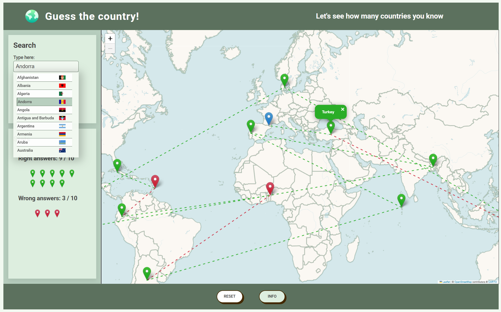

# Guess the Country – Interactive Map Game

A browser-based geography game built with vanilla JavaScript and Leaflet.js.
Players must identify countries based on map markers, with real-time feedback and visual progression.

## Live Demo

👉 [Play the game here](https://jeroen-kuilman.github.io/map-country-game/)

⚠️ Note: the game is not responsive (yet), so the game is not optimized for phones and tablets. In version 2.0 there will be a focus on responsiveness.

## Tech Stack

**JavaScript (ES6+)**

- ES6 modules
- classes with private fields
- async/await
- Promise.all for parallel data fetching
- The Fisher-Yates shuffle algorithm
- JSDoc documentation

**Leaflet.js**

- Interactive map rendering
- Custom marker icons
- GeoJSON country borders
- Dynamic popups
- polylines
- programmatic camera control

**REST APIs**

- Three parallel external data sources merged and cross-referenced (country info, coordinates, population)
- GeoJSON border dataset

**CSS3**

- Custom properties
- CSS grid and flexbox
- Rem-based scalable typography
- Clamp() for fluid sizing
- Custom button states

**HTML5**

- Semantic structure
- Accessible form elements
- Native search input

**Vite**

- Build tooling
- Dev server
- Production bundling

**NPM**

- Dependency and package management

**GitHub Pages / gh-pages**

- Automated deployment pipeline

**Git**

- Version control with conventional commit messages

## Architecture

## Key-challenges

## Nederlandse versie (ENGLISH VERSION BELOW)

### Spelregels en features:

Om het spel te beginnen, klik op start en het spel genereert een ronde waarin je het door de marker aangewezen land moet benoemen. Het spel eindigt wanneer je of 10 goede antwoorden hebt, of 10 foute antwoorden. Type je antwoord in het veld linksbovenin. Er zijn verschillende manieren om je antwoord te bevestigen en om de bijbehorende lijst te navigeren.

- Om gebruik te maken van de autocomplete:
  - Gebruik Tab om te navigeren door de lijst, en klik Enter om de lijstoptie te bevestigen.
  - Als het antwoord dat je wilt geven de eerste optie van de lijst is, klik Enter en je antwoord wordt direct ingevuld en bevestigd.
  - Je kan ook met de muis een optie uit de lijst selecteren. Het antwoord wordt automatisch bevestigd.
  - Weet je het niet meer? Klik op de info knop.

- Kaart features:
  - Markers kleuren aan de hand van een goed of fout antwoord.
  - Polylines (lijnen tussen markers) worden toegevoegd, met dynamische kleuring, zodat het verloop van het spel visueel getraced kan worden.
  - Markers (niet de blauwe) hebben popups. Om te openen, klik op een marker. Groene markers geven alleen het correcte antwoord. Rode markers geven het foute gegeven antwoord en het correcte antwoord.

- Overige features:
  - Feedback rechtsbovenin op basis van de game state.
  - De START knop, verandert in een RESET knop wanneer het spel actief is, en verandert terug naar een START knop als het spel afgerond is.
  - Error-bericht wanneer de API fetches falen.

### Mijn motivatie, leerervaringen en verantwoording:

Dit was voor mij het tweede project dat ik zelfstandig bouwde in HTML/CSS en JavaScript. De aanleiding van dit project, was de afronding van mijn JavaScript cursus. Ik had veel nieuwe theoretische kennis meegekregen, en ik vond dat het tijd was om dat in de praktijk toe te passen. Dit project had een aanzienlijk grotere scope dan mijn vorige project, zeker aangezien mijn intentie al heel vroeg was om gebruik te maken van een externe library en een API, en dus was er iets vereist wat ik in mijn vorige project had nagelaten: een planning. Ik had de core van wat mijn spel moest zijn al in mijn hoofd zitten, dus ik begon dus met het opstellen van wat eenvoudige user-stories, van een flowchart, het creëren van een simpele mockup, en een splitsing te maken voor welke modules verantwoordelijk moesten zijn voor welke code. Dit is de kern geweest voor dit project, en is ook de reden dat ik tevreden terug kan kijken op het resultaat tot nu toe. Het grootste compliment dat ik mezelf kan geven is dat het uiteindelijke resultaat grotendeels overeenkomt met de oorspronkelijke flowchart. Ik had een resultaat in mijn hoofd, en ik heb dat resultaat gemaakt.

Toch was het niet zonder tegenslagen. Ik had halverwege toch nog best moeite om mijn code over verschillende modules te volgen. Oorspronkelijk had ik het idee om met een MVC (module-view-controller) architectuur te werken, maar dat liet ik al snel gedurende mijn planning los. In plaats daarvan, werd het een lossere variant ervan. Niet: het MOET MVC, maar: hoe kan MVC me eventueel op bepaalde plekken helpen? En dat werkte grotendeels in mijn voordeel, zeker in het begin. Het was direct duidelijk in welke module mijn code moest. De state en app functionaliteiten in appModule, event handlers, de init en de gameplay-loop in de main(controller) en UI gerelateerde zaken zoveel mogelijk in eigen modules als een class met bijbehorende methods. Maar de appModule en main raakte al snel met elkaar verweven, en toen ik eenmaal zover was dat ik de gameplay loop moest stroomlijnen (start spel -> begin -> middel -> einde -> start spel -> etc), dat was het moment dat ik even helemaal de draad kwijt was. Dus een refactor sessie was nodig. Voordat ik daaraan kon beginnen, moest ik echter eerst in kaart brengen hoe mijn code op dit moment werkte, en hoe het in de toekomst moet gaan werken. Om dit voor mezelf te visualiseren heb ik een model opgesteld, niet volgens een bestaande standaard (volgende keer wil ik dat wel), maar wel op een manier dat ik weer overzicht kreeg. Dit leidde tot success, waardoor het na het refactoren eigenlijk redelijk vlot ging. Daarna waren eventuele prestatiedips meer afkomstig vanuit vermoeidheid, dan warrige code.

### Wat zou ik de volgende keer anders doen?

Anders, op basis van fouten en verkeerde aanpakken, niet veel. Ik denk dat het vooral een kwestie is van mijn huidige aanpak aan te scherpen doormiddel van oefenen. Wel wil ik een betere manier van modelleren voordat ik ga refactoren, aangezien, zoals ik al zei, het nu op een eigen manier deed. Voor zo'n project prima, maar in teamverband of bij grotere projecten is dat natuurlijk niet houdbaar. Ook zou ik het liefste iets meer rust nemen tussendoor, echter had ik voor dit project een redelijk strakke deadline staan voor mezelf, dus dat was nu gewoon geen optie.

Binnenkort start ik met React, en mijn volgende project zal dus ook gebruik maken van dat framework. Ook wil ik Jest gaan gebruiken voor testen. Dit is dus niet een kwestie van anders doen, maar mijn huidige toolset uitbreiden.

### Wat ik nog wil toevoegen in de toekomst / bugfixes:

Het project is nog niet af. In ieder geval wil ik een 2.0 versie uitbrengen waarin ik responsiveness aanbreng. Het lijkt me ontzettend leuk als ik dit ook op mijn telefoon zou kunnen spelen, dus die motivatie is ook wel persoonlijk. Ook lijkt het mij wel een leuk idee om bepaalde aspecten op te slaan in de local storage en om een functionaliteit te ontwikkelen om de geschiedenis van vorige spellen in te zien. Dus in feite de einduitslagen terug te zien op de kaart van vorige spellen. De data is er, en het is vooral een kwestie van het samenbrengen op de juiste plek.

## English version

### Game rules and features:

### My motivation, learning experiences, and justification:

### What would I do differently next time?

### What I still want to add in the future / bug fixes:
